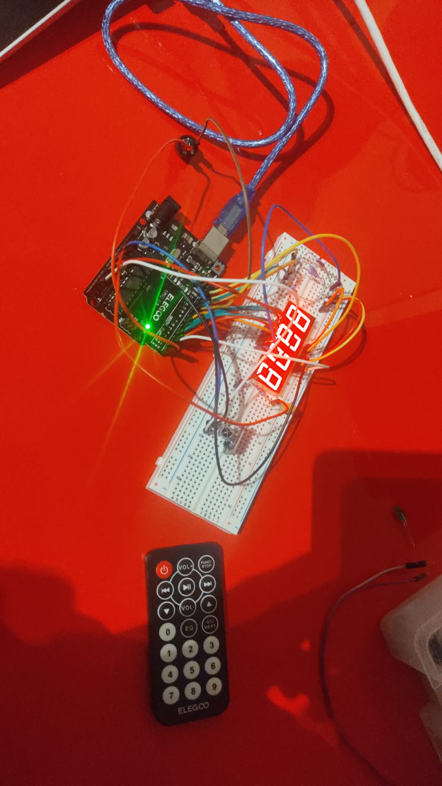
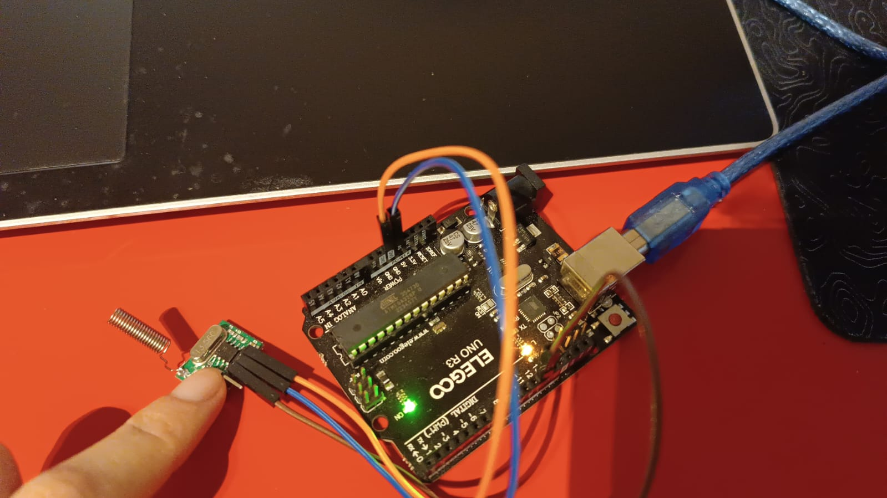
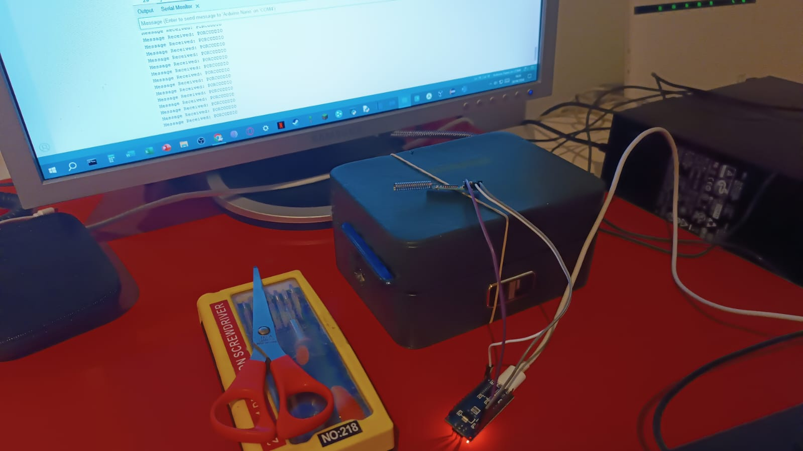

# Arduino-Taser-Timer
Arduino timer that lights a 50k volts taser, activated by a remote, a radio module, buttons or a radio-activated relay.

# 🔋 Parts and robotics

- Any arduino board x2
- rf 433mhz trasmitter, they all function similarly
- rf 433mhz reciever, " "
- Button : )
- 50.000v high voltage generator (3-7v input typically)
- 4-digits display
- relay OR servo OR transistor (a powerful one tho)
- Infrared remote module (remote + receiver)
- low resistor 

# 💻 Code

The codes i provided are different ways to activate the taser, once the countdown begins, it will be shown on the 4-digit display (u might wanna connect the pins with care or else the digit will be corrupted like in my case xd). Once the countdown reaches 0, a servo moves a battery which closes a circuit between itself and the Taser, activating it. You can replace the servo with a simple relay, or a very strong transistor. Be careful because as i've shown on my [spider bot](https://github.com/Hue-Jhan/Arduino-Spider-Bot) the transistor might blow up due to the high current/voltage passing through it, use a strong resistor! You can find the timer and display code in the `taser_timer.ino`.

### 1) Infrared Remote module

Here i used a simple remote, u can change the button code to insert any specific button u like, u can get the button codes by simply serial printing the data once u push a button. You can find the code in `simple_remote.ino`, the range of the remote is less than 10 meters tho.

https://github.com/user-attachments/assets/ee8edd16-097a-43c6-a164-cab68a828685

### 2) Rf 433Mhz radio Module  

You can amplify the range of this """"timer""" by using the rf module, this module consists in a Receiver (pic on the right) and a trasmitter (pic below). There are several kinds of modules you can buy, but they all pretty much work the same way so it doesnt matter which one u buy. Friendly advice: if u can, buy the ones where the antenna is already pre-soldered, because soldering it can be a pain in the 4$$. The longer is the antenna, the bigger will   be the range they can operate in, in my case it should be around 1km, the ones with the small copper-colored antenna should have a range inferior to 100m, the range decreases inside buildings of course.

The code, which u can find in `simple_transmitter.ino` and `simple_receiver.ino`, is very simple, it's litterally just an if/else condition, you may add ecnryption to make it unreadble.

` `
